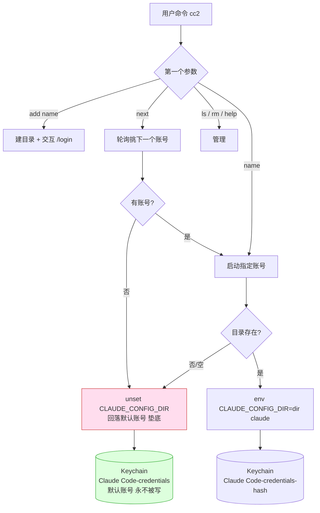

# claude-multi-acct (cc2)

官网 **多账号并行 / 轮询** 工具。核心目标：让多个 Claude 官网账号能**同时并行跑**、均摊用量，同时保证**当前账号永远垫底**——本工具任何代码路径都不会修改默认账号凭证，出任何问题都回落到默认账号。

## 为什么这样就够了（机制，反查自 `claude` 二进制 v2.1.216）

Claude Code 的官网凭证服务名由这段逻辑决定：

```js
// 服务名 = "Claude Code-credentials" + (设了 CLAUDE_CONFIG_DIR 则追加 "-<sha256(dir)[:8]>")
r = !process.env.CLAUDE_CONFIG_DIR;
o = r ? "" : `-${sha256(configDir).slice(0,8)}`;
return `Claude Code-credentials${o}`;
```

读取顺序 `pwc(keychain, plaintext)`：先读 Keychain，读不到再回退读该配置目录下的 `.credentials.json`。

结论：

| 场景 | Keychain 条目 | 隔离性 |
|---|---|---|
| 不设 `CLAUDE_CONFIG_DIR`（现有 `cc`） | `Claude Code-credentials` | **默认账号，本工具永不修改** |
| `CLAUDE_CONFIG_DIR=…/accounts/foo` | `Claude Code-credentials-<hash>` | 独立凭证，可并行 |

所以**一个 `CLAUDE_CONFIG_DIR` 目录 = 一个账号**，凭证隔离由 claude 自己按目录 hash 完成，天生支持多终端同时跑。

## 架构



## 安装

已自动接入 `~/.bashrc`（幂等，带 `>>> claude-multi-acct` 标记）。新开终端或：

```bash
source ~/.bashrc
```

## 用法

```bash
cc2 add work2       # 新增账号 work2 并交互登录 (/login)
cc2 work2           # 以 work2 账号启动 claude
cc2 work2 --resume  # 参数原样透传给 claude
cc2 next            # 轮询: 自动挑下一个账号启动, 均摊用量
cc2 ls              # 列出所有账号及登录状态
cc2 rm work2        # 删除账号目录 (从不碰默认 ~/.claude)
cc2 help
```

并行跑：在不同终端分别 `cc2 alpha`、`cc2 beta`、`cc2 gamma`，互不干扰，各耗各的用量。

## 安全保证（垫底）

- 本工具**仅在设置了 `CLAUDE_CONFIG_DIR` 时工作**，而默认账号凭证在 `Claude Code-credentials`（无后缀）这条谁都不去写的条目里——结构性隔离，不靠代码小心。
- 任何解析失败（未知账号、空账号池）一律 `unset CLAUDE_CONFIG_DIR` → 回落默认账号。
- 现有 `cc` / `ccr` / `ccl` / `cclr` 完全不受影响。
- `cc2 rm` 有护栏，只删 `accounts/` 内目录，绝不误删 `~/.claude`。

## 配置项（环境变量，可选）

| 变量 | 默认 | 说明 |
|---|---|---|
| `CMA_HOME` | `~/Project/claude-multi-acct/accounts` | 账号数据根目录 |
| `CMA_CLAUDE_FLAGS` | `--dangerously-skip-permissions --remote-control` | 启动 claude 的固定参数，与 `cc` 一致；`cc2 <name>` / `next` / `add` 全部带上 |

## 备注

- `cc2 ls` 的"已登录"检测按二进制里的 hash 算法计算 keychain 服务名，属尽力而为、仅供展示，不影响启动。
- 卸载：删掉 `~/.bashrc` 里 `>>> claude-multi-acct` 标记块即可（备份见 `~/.bashrc.bak.cma.*`）。
