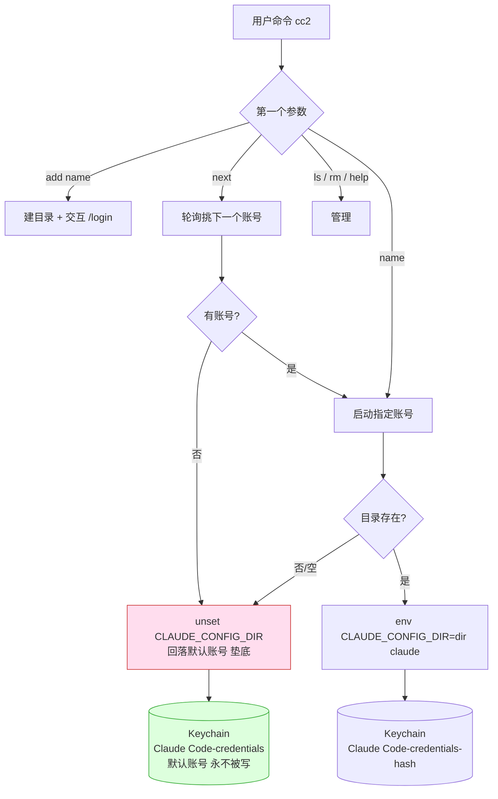
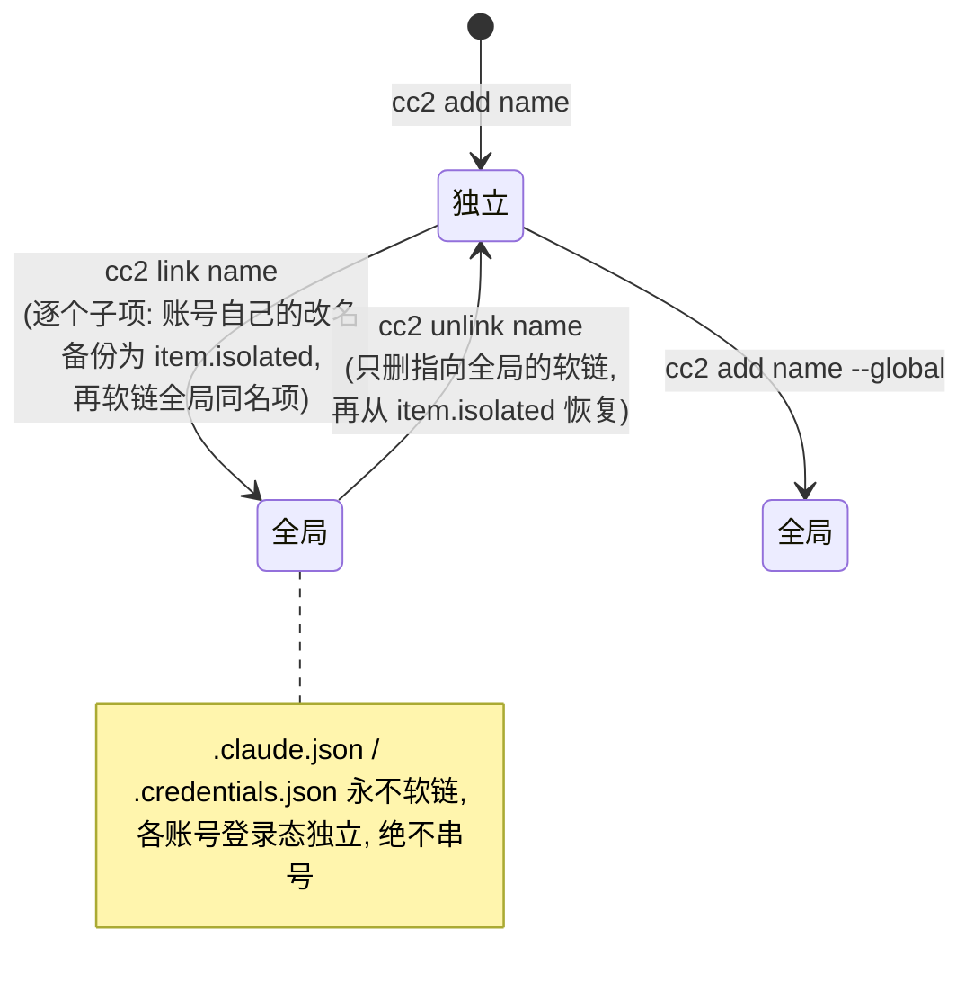

# claude-multi-acct (cc2)

官网 **多账号并行 / 轮询** 工具（Go 单二进制，零第三方依赖）。核心目标：让多个 Claude 官网账号能**同时并行跑**、均摊用量，同时保证**当前账号永远垫底**——本工具任何代码路径都不会修改默认账号凭证，出任何问题都回落到默认账号。

## 为什么这样就够了（机制，反查自 `claude` 二进制 v2.1.216）

Claude Code 的官网凭证服务名由这段逻辑决定：

```js
// 服务名 = "Claude Code-credentials" + (设了 CLAUDE_CONFIG_DIR 则追加 "-<sha256(dir)[:8]>")
r = !process.env.CLAUDE_CONFIG_DIR;
o = r ? "" : `-${sha256(configDir).slice(0,8)}`;
return `Claude Code-credentials${o}`;
```

读取顺序 `pwc(keychain, plaintext)`：先读 Keychain，读不到再回退读该配置目录下的 `.credentials.json`。

结论：

| 场景 | Keychain 条目 | 隔离性 |
|---|---|---|
| 不设 `CLAUDE_CONFIG_DIR`（现有 `cc`） | `Claude Code-credentials` | **默认账号，本工具永不修改** |
| `CLAUDE_CONFIG_DIR=…/accounts/foo` | `Claude Code-credentials-<hash>` | 独立凭证，可并行 |

所以**一个 `CLAUDE_CONFIG_DIR` 目录 = 一个账号**，凭证隔离由 claude 自己按目录 hash 完成，天生支持多终端同时跑。

## 架构



## 安装

装好后**无需 source 任何东西**，新开终端直接用 `cc2`。账号数据默认放 `~/.cc2/`（与 `~/.claude` 同级的规范位置，可用 `CMA_HOME` 覆盖）。

### 方式一：Homebrew（推荐）

```bash
brew install TITOCHAN2023/tap/cc2
# 升级
brew update && brew upgrade cc2
```

### 方式二：直接下载预编译二进制

```bash
# macOS Apple Silicon (其余: cc2-darwin-amd64 / cc2-linux-amd64 / cc2-linux-arm64)
curl -L https://github.com/TITOCHAN2023/claude-multi-acct/releases/latest/download/cc2-darwin-arm64 \
  -o ~/.local/bin/cc2 && chmod +x ~/.local/bin/cc2
```

### 方式三：go install

```bash
go install github.com/TITOCHAN2023/claude-multi-acct@latest
# 产出的二进制名为 claude-multi-acct, 按需改名/软链:
ln -sf "$(go env GOPATH)/bin/claude-multi-acct" ~/.local/bin/cc2
```

### 方式四：源码编译

```bash
git clone https://github.com/TITOCHAN2023/claude-multi-acct
cd claude-multi-acct && make install        # -> ~/.local/bin/cc2
# 自定义位置: make install BIN=/somewhere/cc2
```

> 早期为 shell 脚本版（`cma.sh`，需 source 到 `.bashrc`），现已用 Go 重写成单二进制，去掉了对 `python3`/`shasum` 的依赖、修正了中文对齐。旧版仍在 git 历史里。

## 发版（维护者）

```bash
make release VERSION=x.y.z        # 交叉编译 dist/cc2-* + SHA256SUMS
./scripts/release.sh x.y.z        # 建 GitHub Release 并自动更新 homebrew-tap formula
```

## 用法

```bash
cc2 add work2            # 新增账号 work2 并交互登录 (/login)
cc2 add work3 --global   # 新增并直接共享全局设置(选择性软链具体子项)
cc2 work2                # 以 work2 账号启动 claude
cc2 work2 --resume       # 参数原样透传给 claude
cc2 next                 # 轮询: 自动挑下一个账号启动, 均摊用量
cc2 link work2           # 切到[全局]: 软链 skills/plugins/settings 等子项到 ~/.claude
cc2 unlink work2         # 切回[独立]: 断开软链, 从备份恢复
cc2 set work2 skip on    # 打开 --dangerously-skip-permissions (默认关)
cc2 set work2 rc on      # 打开 --remote-control (默认关)
cc2 set default skip on  # 也可给垫底账号设开关
cc2 ls                   # 列出账号 / 模式 / 启动参数开关 / 登录邮箱 / 凭证
cc2 rm work2             # 删除账号 (从不碰 ~/.claude)
cc2 help
```

## 启动参数开关

`--dangerously-skip-permissions` 和 `--remote-control` 是**每账号独立的开关，默认全部关闭**，用 `cc2 set` 打开/关闭，`cc2 ls` 可查看：

```bash
cc2 set <账号|default> skip on|off   # skip = --dangerously-skip-permissions
cc2 set <账号|default> rc   on|off   # rc   = --remote-control
```

- 状态用账号目录里的标记文件记录（`.cma-flag-skip` / `.cma-flag-rc`），不进 git、不进软链清单。
- `default` 指垫底账号（回落时使用）。
- 启动时按开关动态拼接参数；都关则不带任何危险参数（最安全默认）。

## 默认账号槽位（init / use / restore）

把 `cc`（不带 `CLAUDE_CONFIG_DIR`）用的默认环境看成一个**可切换的"激活槽位"**，账号库里的账号可随时提升为默认。

- **首次引导（init）**：首次安装、账号库为空且默认账号已登录时，自动把默认账号存档为账号 `1`（全局模式）。已有账号则不触发。设 `CMA_NO_INIT=1` 可跳过。
- **`cc2 use <账号> [--full]`**：把该账号的凭证覆盖到默认环境，于是 `cc`/默认 claude 就变成该账号。
  - 默认**只换登录身份**（keychain 凭证 + `~/.claude.json` 里的 `oauthAccount`/用量），保留默认账号的 projects/skillUsage 等本机状态。
  - `--full`：整体覆盖 `~/.claude.json`。
  - **覆盖前自动备份**当前默认到 `~/.cc2/.slot-backup/`。
- **`cc2 restore`**：从备份一键还原上一次 `use` 前的默认账号。
- `cc2 ls` 中 **★** 标记当前默认槽位对应的账号。

> ⚠️ 这是唯一会**主动写入默认账号凭证**的功能（打破早期"垫底永不改"的约定）；但每次都先备份、`cc2 restore` 可还原。已验证 `use`→`restore` 对 `~/.claude.json` 字节级无损。

## 会话监控 / 自动切换（sessions / watch）

### `cc2 sessions` — 看所有正在使用的 claude session
枚举正在运行的 claude 进程（= 已加载的活跃 session，不含未加载的），显示每个的 **账号 / 项目 / 标题(最近用户请求) / 忙闲 / 活动时间**：

```
cc2 sessions        # 或 cc2 ps
```
- 账号来自进程的 `CLAUDE_CONFIG_DIR`（无=默认垫底）。
- 忙/闲用 session 文件最近活动时间近似（90 秒内有活动=●忙）。
- 局限：claude 未对外暴露稳定的"此刻在执行哪个工具"接口，也不在进程 env 暴露 sessionId，所以"标题"取该项目最新 session 的首条真实用户请求；同一项目多 session 会共享标题。

### `cc2 watch` — 后台常驻，逼近额度自动切账号
只监测**默认（垫底）账号**：有活跃 session 时定期查其实时用量，`five_hour` 逼近阈值（默认 95%）就自动 `cc2 use` 下一个还有余量的账号。

```bash
cc2 watch                 # 默认: 每 60s 检查, 阈值 95%
cc2 watch 30 90           # 每 30s 检查, 阈值 90%
# 后台常驻:
nohup cc2 watch > ~/.cc2/watch.log 2>&1 &
```
- 只在默认账号**有活跃 session 时**才查用量（省 API、避免限流；最小间隔 15s）。
- 自动切换=覆盖默认槽位凭证（同 `cc2 use`，覆盖前自动备份，可 `cc2 restore`）。
- **不影响运行中的 session**（它们内存里的 token 不变）；下次新开的默认 claude 才用新账号——所以你几乎无感地就换到了有余量的账号。
- 找不到可切换账号（其余都逼近上限或未登录）时只告警、不切换，并发桌面通知。

并行跑：在不同终端分别 `cc2 alpha`、`cc2 beta`、`cc2 gamma`，互不干扰，各耗各的用量。

## 独立 / 全局 两种模式

每个账号可在两种模式间切换。**凭证与登录态在两种模式下都完全独立**（keychain 按 `CLAUDE_CONFIG_DIR` 路径字符串 hash；而 `.claude.json`/`.credentials.json` 永不软链）：

- **[独立]**（默认）：`accounts/<name>` 是普通目录，配置/skills/plugins 都是这个账号自己的。
- **[全局]**：只把 **具体子项** 软链到 `~/.claude`，共享你精心配置的全局资产；`.claude.json`（登录身份）和 `.credentials.json`（凭证）留在账号自己目录里。

默认软链清单（环境变量 `CMA_GLOBAL_LINKS` 可增减）：

```
settings.json  CLAUDE.md  skills  plugins  commands  agents  sessions  projects  todos
```

> ⚠️ **为什么不整目录软链？** `.claude.json` 含 `oauthAccount`（登录身份），且它不在 `~/.claude/` 里而在 `~/.claude.json`。若整目录软链到 `~/.claude`，多个全局账号会共写同一个 `~/.claude/.claude.json` → **登录态互相覆盖 / 串号**。所以只软链无身份的资产，`.claude.json`/`.credentials.json` 由 `_cma_never_link` 强制排除，即便手动塞进清单也不会被软链。

切换语义（完全可逆）：



## 安全保证（垫底）

- 本工具**仅在设置了 `CLAUDE_CONFIG_DIR` 时工作**，而默认账号凭证在 `Claude Code-credentials`（无后缀）这条谁都不去写的条目里——结构性隔离，不靠代码小心。
- 任何解析失败（未知账号、空账号池）一律 `unset CLAUDE_CONFIG_DIR` → 回落默认账号。
- 现有 `cc` / `ccr` / `ccl` / `cclr` 完全不受影响。
- `cc2 rm` 有护栏，只删 `accounts/` 内目录，绝不误删 `~/.claude`。
- `cc2 link` 逐个子项处理：账号自己的同名项先改名备份为 `<item>.isolated`，再软链全局同名项；`cc2 unlink` 只删指向全局的软链（`rm -f`，绝不 `rm -rf` 到目标），再从备份恢复。全程不复制/删除 `~/.claude` 内容。
- `.claude.json`（登录身份）与 `.credentials.json`（凭证）由内置 `neverLink` 清单强制排除，任何模式下都各账号独立，绝不串号。
- 启动通过 `syscall.Exec` 替换进程直接接管 claude；构造环境时清空第三方 `ANTHROPIC_*` / `CLAUDE_CODE_*` 变量，按需设/不设 `CLAUDE_CONFIG_DIR`，不污染调用者 shell。

## 配置项（环境变量，可选）

| 变量 | 默认 | 说明 |
|---|---|---|
| `CMA_HOME` | `~/.cc2` | 账号数据根目录 |
| `CMA_GLOBAL_DIR` | `~/.claude` | [全局]模式软链的目标 |
| `CMA_GLOBAL_LINKS` | `settings.json CLAUDE.md skills plugins commands agents sessions projects todos` | [全局]模式软链的具体子项清单 |
| `CMA_CLAUDE_FLAGS` | 空 | 额外附加的启动参数（逃生阀）；`skip`/`rc` 请用 `cc2 set` 开关 |

## 备注

- `cc2 ls` 的"已登录"检测按 keychain 服务名（`sha256(dir)[:8]`）尽力探测，仅供展示，不影响启动。
- 卸载：`rm ~/.local/bin/cc2`，并删掉 `~/.bashrc` 里 `>>> claude-multi-acct` 标记块即可（备份见 `~/.bashrc.bak.cma*`）。
